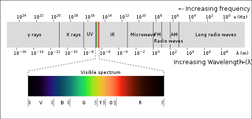

# Why computational modeling? {#intro}

The field of psychology is full of theories. But this book is focused on a specific type of theory: the type that can be formalized as a computational model.

What advantage does a computational (or mathematical) theory have over one that can't be expressed in computational terms? The biggest advantage is precision. For example, suppose you say that attention is like a spotlight 🔦: you can attend to things that are currently within the light, and you can control where the light is shining, but things outside of the light are outside of our awareness. This is a kind of theory -- an analogy-based one -- and it's a good start for making some general *qualitative* predictions about how attention works.

But you'll quickly run into problems if you want to make precise *quantitative* predictions about attention. How big is the spotlight? Does the size expand and contract? How quickly does it move around? Is attention completely absent outside of the spotlight or does it ramp down as you get near the edge of the light? In other words, if you wanted to build a computer model of this theory, a simple analogy doesn't cut it.

*Computational models, if nothing else, force us to be explicit about all of our assumptions.*

## Representations 🔸

We don't perceive the world as it truly is. To give one example, the visible spectrum that our eyes can detect is just a fraction of the full electromagnetic spectrum. In other words, we're seeing an incomplete picture of the surrounding world.

```{r echo=FALSE, out.width='95%', fig.cap='The visible light spectrum. Source: Philip Ronan/Wikipedia.'}

```

Similarly, we are constantly making assumptions about the things we see and hear and using those assumptions to fill in gaps.

What we have in our heads is a kind of model of the world around us -- what cognitive scientists call a mental representation. These representations help us to reach rapid conclusions about things involving language, causes and effects, concepts, mental states, and many other aspects of cognition.

Some of the key questions for cognitive scientists who use computational models are:

1. What mental representations do we rely on?
2. How do our minds use these representations to learn when we get new information?
3. What kind of information do we get and how do our expectations about the kind of information we're getting to affect how we use it?

This book will elaborate, with examples, on each of these questions.

## Homework 1: Build your first computational model 💻

[](https://colab.research.google.com/drive/1MEiil0swXHERwJ38rVGZPTndyetHJPYQ?usp=sharing)

To get some initial experience with computational modeling, you'll build and experiment with a simple model of classical conditioning developed by Robert Rescorla and Allan Wagner -- now called the Rescorla-Wagner model.

All homework assignments for this book will be done in Google Colab. Click the button above at the top of this section view Homework 1.

If you're unfamiliar with Colab (or Jupyter Notebooks), watch this brief introduction video.

<iframe width="560" height="315" src="https://www.youtube.com/embed/inN8seMm7UI" title="YouTube video player" frameborder="0" allow="accelerometer; autoplay; clipboard-write; encrypted-media; gyroscope; picture-in-picture" allowfullscreen></iframe>

::: {.rmdnote}
Note: You'll have to make a copy of the notebook saved to your own Drive in order to edit it.
:::
