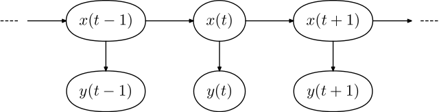
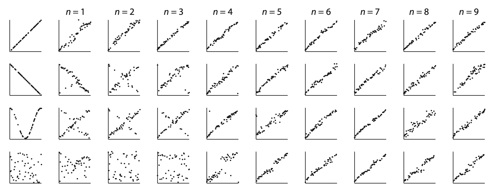

# Iterated learning {#iterated-learning}

If someone told you they defecated their water before drinking it, you probably wouldn't be too impressed. Unless you lived in the 1600s, when "defecate" [meant "to purify something"](https://www.mentalfloss.com/article/54770/15-words-dont-mean-what-they-used).

Language changes. Words change. Concepts change. Is there any way to predict the conceptual drift that is always happening in our culture?

Yeah, maybe, kinda! But first, some math. 

## Markov chains 🔗 {#markov-chains}

Words and concepts change over *time*. **Markov chains** provide a useful modeling framework for time-dependent data.

As the name suggests, a Markov chain is a chain, specifically of states. At each time step, it moves to a new state. A Markov chain meets the following conditions:

1. A system can be in a finite number of states. 
2. The state at each step of the chain depends only on the previous state. (This dependence can be probabilistic.)

For example, consider the game Telephone, where one person whispers a word to the next person, they whisper what they hear to the next person, and so on. The set of possible words are the states (finite but admittedly large). 

The word that Person $n+1$ hears clearly only depends on the word that Person $n$ whispered. But there might be some miscommunication: the probability that Person $n+1$ accurately hears the word is probably less than 1, with similar-sounding words getting higher probability than dissimilar words.

### Examples

Consider a very simple chain of colors that are either red or blue. Here, the state space $S = \{ \text{red, blue} \}$. To specify this Markov chain, we need to define the *transition probabilities*: the probabilities of moving from each state to every other state.

Let $t_{ij}$ be the probability of transitioning from state $i$ to state $j$. For example, if $t_{RB} = 0.3$ then the probability of transitioning from the red state to the blue state is 0.3. We can then write the transition probabilities in a matrix.

#### Example 1 {#markov-exmaple1}

Here's our transition probability matrix.

|    | R  | B  |
| -- | -- | -- |
| R  | 0  | 1  |
| B  | 1  | 0  |

In this example, $t_{RB} = t_{BR} = 1$. This means that the chain will deterministically alternate between red and blue. Note that the rows of the transition matrix must sum to 1 because they represent all the possible states that the chain might transition to given a current state. Although the columns also sum to 1 in this example, this is not a requirement.

*Example sequence*: <span style="color: red;">R</span> <span style="color: blue;">B</span> <span style="color: red;">R</span> <span style="color: blue;">B</span> <span style="color: red;">R</span> <span style="color: blue;">B</span> ...

#### Example 2 {#markov-example2}

|    | R     | B     |
| -- | ----- | ----- |
| R  | 0.25  | 0.75  |
| B  | 0.75  | 0.25  |

In this example, we'd expect to the sequence to flip back and forth between red and blue, but not deterministically. At every step, the sequence is more likely to flip than to stay in the current color.

*Example sequence*: <span style="color: red;">R</span> <span style="color: blue;">B</span> <span style="color: red;">R</span> <span style="color: red;">R</span> <span style="color: blue;">B</span> <span style="color: red;">R</span> <span style="color: red;">R</span> <span style="color: blue;">B</span> <span style="color: red;">R</span> <span style="color: blue;">B</span> <span style="color: red;">R</span> ...

#### Example 3 {#markov-example3}

|    | R     | B     |
| -- | ----- | ----- |
| R  | 0.75  | 0.25  |
| B  | 0.75  | 0.25  |

In this example, no matter what state we're in, there is a 0.75 probability of moving to red and a 0.25 probability of moving to blue. Therefore, in this example, we'd expect the chain to spend about 3/4 of its time in the red state and 1/4 of its time in the blue state. This example makes clear that the columns do not need to sum to 1.

*Example sequence*: <span style="color: red;">R</span> <span style="color: red;">R</span> <span style="color: blue;">B</span> <span style="color: blue;">B</span> <span style="color: red;">R</span> <span style="color: red;">R</span> <span style="color: blue;">B</span> <span style="color: blue;">B</span> <span style="color: red;">R</span> <span style="color: red;">R</span> <span style="color: red;">R</span> ...

### Stationary distributions

A common question for a given Markov chain is what is its so-called *stationary distribution*, the proportion of time the chain will spend in each state if it runs for a very long time. For Markov chains a small number of states, computing the stationary distribution is easy to do with some algebra. Consider the following example.

Let's define a transition matrix for Markov chain with two states, $s_1$ and $s_2$:

$$
\begin{equation}
T = \left(
\begin{matrix}
t_{11} & t_{12} \\
t_{21} & t_{22}
\end{matrix} \right)
\end{equation}
$$

The stationary distribution corresponds to the probability of the chain being in state $s_1$ versus $s_2$. We will define $\theta_1$ as the probability of the chain being in state $s_1$ and $\theta_2$ as the probability of the chain being in state $s_2$. We can define $\theta_1$ and $\theta_2$ recursively as follows:

$$
\begin{eqnarray}
\theta_1 = t_{11} \theta_1 + t_{21} \theta_2 \\
\theta_2 = t_{22} \theta_2 + t_{12} \theta_1 \\
\end{eqnarray}
$$

These equations essentially say that the probability of being in a state is the probability of being in that state and staying in that state plus the probability of being in the other state and switching states. We will then use the following facts to solve for the $\theta$s:

$$
\begin{eqnarray}
\theta_1 + \theta_2 = 1 \\
t_{11} + t_{12} = 1 \\
t_{21} + t_{22} = 1
\end{eqnarray}
$$

Using some algebra, we get the following expressions:

$$
\begin{eqnarray}
\theta_1 = \frac{t_{21}}{t_{12}+t_{21}} \\
\theta_2 = \frac{t_{12}}{t_{21}+t_{12}}
\end{eqnarray}
$$

We can see that these expressions give sensible results by applying them to the red-blue examples above.

In [Example 1](#markov-example1), unsurprisingly, $\theta_R = \theta_B = 0.5$. Because the sequence alternates, it will be red half the time and blue half the time. In [Example 2](#markov-example2), again $\theta_R = \theta_B = 0.5$. Even though the alternating is not deterministic, no matter what state the sequence is in, there is an equal probability that it will switch to the other state. In [Example 3](#markov-example3), $\theta_R = 0.75$ and $\theta_B = 0.25$.

## Hidden Markov models 🙈 {#hmms}

Now let's consider a more complicated situation in which each step in a Markov chain generates an observation. A learner gets to see the observations, but not the states themselves. In this situation, we say that the states are "hidden", hence the name **hidden Markov model**.

Hidden Markov models are sometimes used to model language production, where the hidden states are the parts of speech (like noun, verb, adjective, or more complex things like noun phrases, objects, and subjects). What we actually get to observe as readers and listeners, however, are words (like "dog", "eats", and "play"). In English, many words are ambiguous and can potentially belong to different parts of speech. "Play", for example could be a noun ("The actors performed in a play") or a verb ("The children play in the sand"). We are constantly decoding the language we observe to infer the parts of speech of the words.

### Formal definition

A hidden Markov model includes the following pieces:

1. A set of states $S = \{s_1, \ldots, s_N\}$
2. A set of observations $O = \{o_1, \ldots, o_M\}$
3. A set of initial state probabilities $\Pi = \{\pi_1, \ldots, \pi_N\}$, where $\pi_i$ is the probability of state $i$ begin the first state in the sequence
4. A matrix of state transition probabilities $T$, where $t_{ij}$ in the matrix is the probability of transitioning from state $s_i$ to state $s_j$
5. A matrix of "emission" probabilities $B$, where $b_{ik}$ in the matrix is the probability of producing observation $o_k$ while in state $s_i$
6. An observation sequence $Y = (y_1, \ldots, y_T)$, where $T$ is the length of the observed sequence of data
7. An state sequence that is not observed $X = (x_1, \ldots, x_T)$

```{r echo=FALSE, out.width='85%', fig.align='center', fig.cap='A hidden Markov model. Source: Wikipedia (public domain).'}

```

### Inference

Usually the purpose of using an HMM is to infer $X$ from $Y$. There is a standard algorithm for doing this called [the Viterbi algorithm](https://en.wikipedia.org/wiki/Viterbi_algorithm), the details of which are beyond the scope of this book.

There are many existing programming packages available for working with HMMs. On Python package is [hmmlearn](https://github.com/hmmlearn/hmmlearn), which includes a [`predict()`](https://hmmlearn.readthedocs.io/en/stable/api.html#hmmlearn.base.BaseHMM.predict) function, which will predict the most probable sequence of hidden states $X$, given a sequence of observations $Y$ and a fully specified Hidden Markov model. Note that this function will not always be correct. If the model is probabilistic and there are some observations that can be produced in more than one state (for example, the word "play" could be produced by either the noun or verb state), there will be some cases where it is impossible to be certain which state an observation came from.

## Cultural transmission 🗣

So what does all this have to do with "defecate" changing meaning over time?

Well you can think of communication over time as one giant long-term game of Telephone. And an important question you can then ask is: What is the stationary distribution of these chains?

This is the subject of a line research in computational cognitive science. The basic model combines some assumptions we've seen before with some assumptions of hidden Markov models you just learned about in this chapter.

First, assume that people are trying to learn some concept by seeing an example $x_i$ and getting a label for it $y_i$ and then trying to generalize that label to other instances by forming a hypothesis $h$ about what other things $y_i$ applies to. This is the problem we encountered in the [generalization chapter](#generalization), and we can assume that each person forms their beliefs about $h$ using Bayesian inference.

Now let's add in the communication factor. Each person $n+1$ gets a label $y_n$ from someone else Person $n$, forms their own hypothesis $h_{n+1}$ then labels a new object $x_{n+1}$ for the next person. This process repeats, creating a Markov chain.

To simplify this chain, what we end up with is a sequence of states where each state is a hypothesis about the concept.

*What will this chain converge to?*

**It turns out that the stationary distribution of this chain is the prior $P(h)$**. Because people make mistakes and communication is noisy, over time, the labels $y_n$ become virtually useless and people will converge to their shared prior beliefs.

### Using iterated learning to identify people's priors

For this reason, we can use a kind of Telephone game as a way to find out what people's shared prior beliefs are.

[A study lead by Michael Kalish](https://link.springer.com/content/pdf/10.3758/BF03194066.pdf) tested this idea for function learning: learning to predict $y$ values from $x$ values.

In the task, people were given $x$ values and had to predict the corresponding $y$ values using a slider. They got feedback on 50 training examples. Then they did an additional 25 trials without feedback.

Those 25 test trials were doubled and used as the 50 training examples for the next person, and so on. What functions would people eventually learn?

The figure below shows several representative chains. The researchers found that regardless of what the initial training data was, the chains usually converged to a linear increasing function, suggesting that this is what most people were expecting.

```{r echo=FALSE, out.width='95%', fig.align='center', fig.cap='Iterated function learning results from Kalish et al. (2007).'}

```

This same method has been applied in other domains as well. For example, in [a study lead by Jordan Suchow](https://suchow.io/assets/docs/suchow2016dzp.pdf), people had to reproduce as accurately as possible the positions of characters in a word. The initial positions were randomly positioned, and what each person reproduced would be passed to the next person in the chain.

```{r echo=FALSE, out.width='70%', fig.align='center', fig.cap='Iterated typestting results from Suchow et al. (2016).'}
knitr::include_graphics("images/09/suchowetal_letterspacing.png")
```

The researchers found that, over time, people drifted much closer to equal spaced letters, which was much more legible. Moreover, if they averaged the responses across all chains (DZP<sub>2</sub> in the figure), they found that people's responses were even better than equal spacing, getting closer to Linotype, recommended by designers.